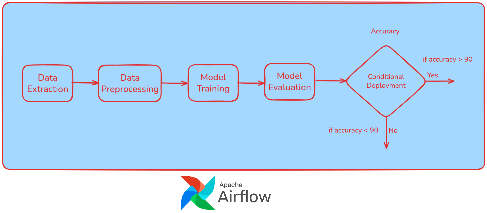

## Automate and Orchestrate ML Pipeline Using Airflow

**Building a robust Machine Learning pipeline involves several steps, and Airflow is a fantastic tool to automate and orchestrate them!**

### **Typical ML Pipeline**



An ML pipeline in Airflow is defined as a DAG, a collection of tasks with defined dependencies. A simple pipeline typically involves these stages:

- Data Ingestion/Extraction: Fetching the data from a source (database, file, API, etc.).

- Data Preprocessing: Cleaning, transforming, and feature engineering the data.

- Model Training: Running your ML algorithm on the prepared data.

- Model Evaluation: Assessing the trained model's performance (e.g., calculating accuracy).

- Conditional Deployment (Optional): Deploying the model only if it meets a performance threshold.

**Set up**

```bash
mkdir airflow-docker && cd airflow-docker
curl -LfO 'https://airflow.apache.org/docs/apache-airflow/stable/docker-compose.yaml'
mkdir -p ./dags ./logs ./plugins ./config
echo -e "AIRFLOW_UID=$(id -u)" > .env
docker compose up airflow-init
docker compose up -d
```