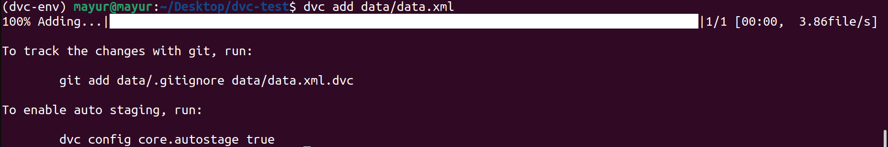

## Data Version Control

**Manage and version images, audio, video, and text files in storage and organize your ML modeling process into a reproducible workflow.**

### Setting up virtual environment

```bash
mayur@mayur:~$ python3 -m venv dvc-env
mayur@mayur:~$ source dvc-env/bin/activate
(dvc-env) mayur@mayur:~$ pip install dvc
```
### Get started with DVC

- Clone a git repo locally
- Switch to git-repo
- Initialize the git repo as dvc repo with below command
```
dvc init
```


```
git status
```


```
git commit -m 'initialize dvc'
```
### Tracking Data

```
dvc get https://github.com/iterative/dataset-registry \
          get-started/data.xml -o data/data.xml
```

To track the file

```
dvc add data/data.xml
```



To track the changes in git, run the command

```
git add data/data.xml.dvc data/.gitignore
git commit -m 'Add raw data'
```

### Storing and Sharing

**Setting up remote directory in local machine**
```
mkdir /tmp/dvcstore
dvc remote add -d myremote /tmp/dvcstore
```


You can pull the data from remote directory using dvc pull.

Let us simulate that locally.

```
rm -rf .dvc/cache
rm -f data/data.xml
```
Next pull the data from remote directory (/tmp/dvcstore)
```
dvc pull
```

### Making Local changes to data

We are just doubling the data.

```
cp data/data.xml /tmp/data.xml
cat /tmp/data.xml >> data/data.xml
```
**Tracking updated data**

```
dvc add data/data.xml
```

**Pushing the data**

```
dvc push
git commit data/data.xml.dvc -m "Dataset updates"
```
### Setting new Remote with GDrive

```
pip install dvc-gdrive
```

```
dvc remote add my_second_remote gdrive://xxxxxxxxxxxxxxxxxxx
dvc push -r my_second_remote
```
---- Test out ---

### Return to a previous version of the dataset

```
git checkout HEAD~1 data/data.xml.dvc
dvc checkout

git commit data/data.xml.dvc -m "Revert dataset updates"
```
