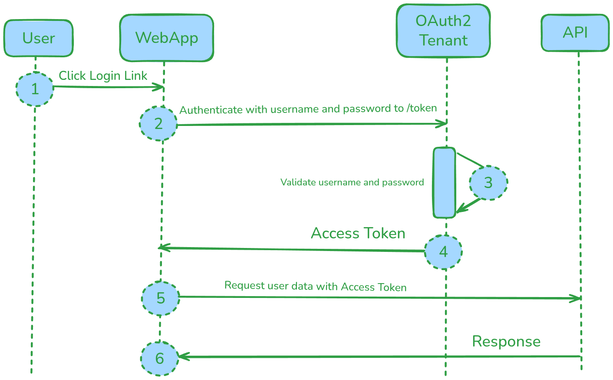

### What is FastAPI?

FastAPI is a modern, high-performance web framework for building APIs with Python 3.7+ based on standard Python type hints. 

*Key benefits:*

It's designed for speed, easy coding, and robustness.

### Why is it Fast?

*ASGI (Asynchronous Server Gateway Interface):*

- FastAPI is built on top of Starlette, an ASGI framework. 
- Unlike the older WSGI standard used by frameworks like standard Flask, ASGI allows for asynchronous programming using Python's `async` and `await` keywords. 
- This is crucial for I/O-bound tasks—like waiting for a database query or an external API call. Instead of one thread being blocked and sitting idle, the server can switch to handle other requests concurrently, leading to incredibly high performance and concurrency.

*Pydantic:*

- FastAPI uses Pydantic for data validation and serialization. 
- Pydantic uses those Python type hints to automatically validate the structure and type of data coming into your API (the request body or parameters) and the data going out (the response).
- This validation is done extremely efficiently and cuts down on developer errors by automatically giving clear, helpful error messages to the client.

### Compare FastAPI against Flask and Django

Django is your go-to if you need a large, feature-rich web application—something with an admin panel, a user system, and an ORM right out of the box.

Flask is perfect for small, simple projects or when you want total control and prefer to choose all your components yourself.

FastAPI shines for building high-performance, modern APIs and microservices. If your primary goal is a fast, robust RESTful API that needs to handle high traffic and leverages modern Python, FastAPI is the clear winner in terms of performance and development speed. Plus, the automatic interactive API documentation using Swagger UI and ReDoc is a massive time-saver!

## *Common Problem: Bad data in your API, missing fields, wrong type, or just garbage in.*

## Pydantic

### It defines the structure of the data it accepts (requests) and the data it sends back (response).

### It is used for Data validation and serialization.

### **Request and Response Model**

**Request Model: Request Models ensure the data coming into your API is correct.**

Task: 
    
    Create a simple Item model for a hypothetical e-commerce API.

    Implementation: Show how to use it in a POST endpoint.

**Response Model: Response Models ensure the data going out of your API is exactly what you promised and nothing more. This is crucial for Security and Consistency.**

### **"Imagine you fetch a user object from a database. It might contain a sensitive field like hashed_password or private_api_key. You MUST NOT send that back!"**


Task:

    Define two models: a database model and a public response model.

**Key takeaways:**

Request Models: For Validation and enforcing a schema on incoming data.

Response Models: For Serialization, Consistency, and crucial Security (data filtering).

## CRUD Operation With FastAPI

CRUD refers to create, read, update, and delete - using a simple, in-memory database.**

**Task**

*Create a simple API for managing a list of items (like products)*

**Steps**

1. Create a Data model: We'll use Pydantic for data validation and enforce a schema.

2. In-memory database and app initialization.

3. Write post, get, put, delete request to perform CURD operation.

- Post request to create a item in a list.
- Get request to fetch a item from the list.
- Put request to update item in the list.
- Delete request to remove item from the list.

## FastAPI and Databases

**Task**

- Building two FastAPI application; asynchronous and synchronous!
- Use Locust to perform Load testing on both the application.

**ORM: object Releational Mapping**

It acts as an abstraction layer that connects your FastAPI application with underlying database.
Instead of writing SQL directly, you interact with the database using Python objects and methods.

FastAPI uses SQLModel ORM, a powerful user-friendly wrapper built on top of SQLAlchemy.
Where SQLAlchemy is an Industry standard, highly flexible, suitable for complex applications.

SQLModel is highly recommended for its excellent integration with Pydantic Models.

### Async and Sync Database calls

We know that FastAPI uses ASGI for enable asynchronous programming.

**Synchronous call**

- Blocking: Server waits for DB query to be completed, until then worker process is blocked and cannot handle other requests.
- Libraries: `psycopg2` or standard `sqlite3`

**Asynchronous call**

- Non-blocking: Server suspends the task after query, and goes on with handling other request. After the query is executed, it resumes the task.
- Result: Significant concurrency, high performance under high load.
- Libraries: `asyncpg`, `aiosqlite`, and modern modern ORMs like SQLModel or SQLAlchemy 2.0+ use asyncio-compatible drivers (e.g., asyncpg or aiosqlite) via the new await syntax.

**Rule of thumb: Always use async database operations in FastAPI.**

## FastAPI Authentication & Authorization



**Task**

Consider you have created an account in a banking website, and you're trying to login. To login, you will use your username and password.

**Authenticate the user and password:**
- Verify the user is present.
- Verify the password is matching.

**Generate Session Token With Expiry:**
- Generate a token with expiry for the session.
- If the session is expired, lock out the user from accessing the API.

pip install fastapi uvicorn python-jose[cryptography] passlib[bcrypt]

#### 2. Run the Application

Save the code above as `main.py` and run it:

```bash
uvicorn main:app --reload
```
#### 3. Login (Getting the JWT Token)

1.  Open your browser and navigate to the interactive documentation: `http://127.0.0.1:8000/docs`.
2.  You will see an **Authorize** button at the top right, and the `/token` endpoint will have a security lock icon.
3.  Click the **Authorize** button. A dialog will pop up asking for **Username** and **Password**.
4.  Enter the hardcoded credentials from the example:
    * **Username:** `testuser`
    * **Password:** `securepassword123`
5.  Click **Authorize**. The Swagger UI will now automatically use the received Bearer token for all protected requests.

**Under the Hood (`@app.post("/token")`):**
* The client sends the username and password as form data to the `/token` endpoint.
* The server calls `authenticate_user` to verify the credentials against the hashed password.
* Upon success, `create_access_token` generates a JWT payload with the user's ID (`"sub": "testuser"`) and an expiration time (`"exp"`).
* The token is signed with the `SECRET_KEY` and returned in the required OAuth2 format: `{"access_token": "...", "token_type": "bearer"}`.

#### 4. Accessing a Protected Endpoint

1.  Find the `/users/me/` endpoint in the docs. It should have a lock icon.
2.  Click on it, then click **Try it out**, and then **Execute**.

**Under the Hood (`@app.get("/users/me/")`):**
* The client includes the token in the request header: `Authorization: Bearer <your-jwt-token>`.
* The `token: Annotated[str, Depends(oauth2_scheme)]` dependency extracts the token from the header.
* The `get_current_user` function runs:
    * It calls `jwt.decode` using the `SECRET_KEY` to verify the signature and check the expiration time.
    * If valid, it extracts the username from the payload and looks up the user data.
    * It returns the `User` object, which is then injected into the route function as `current_user`.
* If the token is invalid or expired, `get_current_user` raises an `HTTPException` with a `401 Unauthorized` status.

This complete implementation provides robust, industry-standard security using the tools built right into FastAPI. Let me know if you'd like to dive deeper into custom scopes or authorization based on user roles!

## FastAPI Dependency Injection System

- It helps in sharing logic, database sessions, authentication, and other componenets straightforward.
- 