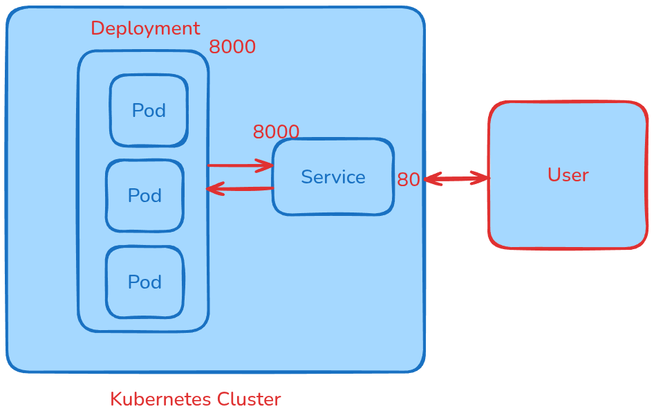

🚀 Practical Tutorial: Serve ML Models with FastAPI

This tutorial provides a step-by-step guide to serving a pre-trained Machine Learning (ML) model using FastAPI and the pickle library for serialization. The same principles apply to models saved with joblib or loading ONNX runtimes.

Task:

- Train a machine learning model.
- Save the model as pickle file.
- Create a FastAPI app.
- Create API endpoint to serve the model.

## 🚀 Practical Tutorial: Scaling ML Models with FastAPI, Docker, and Kubernetes

Pre-requisite
- Docker
- Minikube

In previous video, we built a ml model and served it using FastAPI. Now, we scale the API using 
Containerization and Kubernetes Deployment.

**Tasks**

- Create a Dockerfile
    - Set the environment for ML experiment
    - Run the FastAPI
    - Expose the Port

- Build a docker image
- Save the docker image to remote container registry.
- Start the Minikube Cluster In Local Machine
- Create a Deployment and Service Yaml 
    - Deploy the remote docker image
    - Create 3 replicas (to handle multiple requests)
    - Map Service to deployment
    
    
    

Note:

Kubernetes Services are crucial for providing stable and reliable network access to applications running within a cluster. Their primary uses include: 

• Stable Network Endpoint for Ephemeral Pods: Pods in Kubernetes are designed to be ephemeral; they can be created, destroyed, and rescheduled, leading to constantly changing IP addresses. Services provide a stable, persistent IP address and DNS name that clients can consistently use to access a group of Pods, even as individual Pods come and go. 

• Load Balancing: A Service acts as a load balancer, distributing incoming network traffic across the multiple Pods associated with it. This ensures that no single Pod is overwhelmed and promotes high availability and scalability for your application. 

• Service Discovery: Services enable other applications within the cluster to discover and communicate with a set of Pods without needing to know their individual IP addresses. Kubernetes automatically assigns a DNS name to each Service, allowing for easy in-cluster communication using these names. 

• Exposing Applications: Services provide different ways to expose applications to external traffic: 

	• ClusterIP: Exposes the Service on an internal IP address within the cluster, making it only accessible from within the cluster. 

	• NodePort: Exposes the Service on a static port on each Node in the cluster, making it accessible from outside the cluster via the Node's IP address and the assigned NodePort. 

	• LoadBalancer: Integrates with cloud provider load balancers to expose the Service externally, providing a dedicated external IP address and often more advanced load balancing features. 

	• ExternalName: Maps a Service to an arbitrary external DNS name. 

In essence, Services abstract away the dynamic nature of Pods, providing a consistent and discoverable point of access for applications, both within and outside the Kubernetes cluster. 

