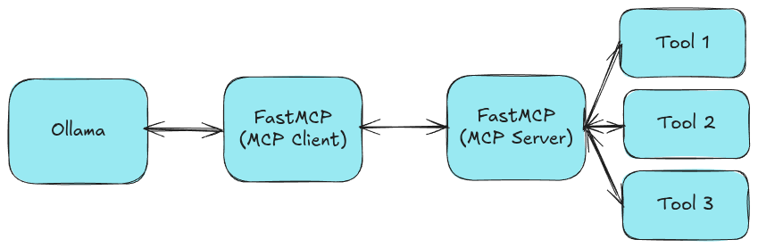

## Build MCP Server (FastMCP) with Ollama and Tool Calling


### Task: Build MCP Server with Ollama



1. User sends the query to Ollama
2. Ollama forwards the query to MCP Server (FastMCP) through MCP Client
3. MCP Server (FastMCP) processes the query and calls the tool if necessary
4. MCP Server (FastMCP) sends the response back to MCP Client
5. MCP Client returns the response to the user through Ollama

### 1. Install Ollama

```bash
curl -fsSL https://ollama.com/install.sh | sh
```

### 2. Creating Virtual Environment and Install FastMCP

```bash
python -m venv deepagent-env
source deepagent-env/bin/activate
pip install fastmcp
```
