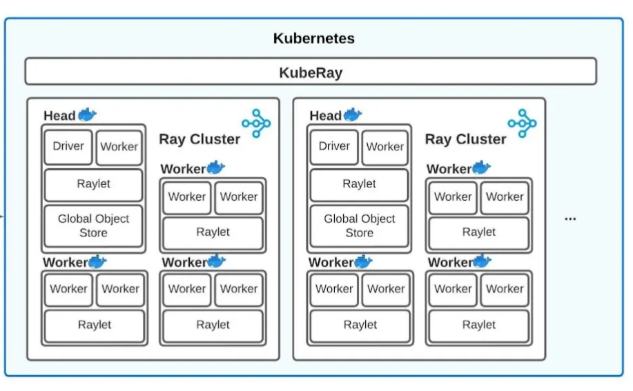

### What is Ray?

- Open source framework designed for building and running distributed apps.




### Why Kuberay?

- It is an extension of the Ray framework specifically designed to run Ray applications on Kubernetes. It enables users to easily deploy, manage, and scale Ray clusters in a Kubernetes environment.

### What is Kuberay operator?

The KubeRay Operator is a Kubernetes operator designed to manage Ray clusters within a Kubernetes environment. Operators are a method of packaging, deploying, and managing a Kubernetes application, and the KubeRay Operator specifically focuses on automating the lifecycle of Ray clusters.

### what is ray cluster?
A Ray cluster is a distributed computing environment created using the Ray framework, designed to enable parallel and distributed execution of tasks.

### What is Head and Worker node in ray cluster?

In a Ray cluster managed by the KubeRay Operator, two main types of pods are created: head pods and worker pods. Each serves a specific role within the Ray architecture.

#### Head Pod

Role: The head pod acts as the control plane for the Ray cluster.

#### Worker Pod

Role: Worker pods are responsible for executing tasks and running the user-defined functions in parallel.

### Installing Kuberay and Ray-cluster

### prerequisite:
- Docker
- minikube (a running cluster inside it.)
- ray and ray[default] (pip package)
- helm (kubernetes package manager)

### Multiple ways to install kuberay 

- Helm
- Kustomize

We'll use Kustomize to set up kuberay.

kuberay using kustomize: https://ray-project.github.io/kuberay/deploy/installation/

**Install CRD and KubeRay operator**

`kubectl create -k "github.com/ray-project/kuberay/ray-operator/config/default?ref=v1.1.0&timeout=90s"`

```
kubectl create -k "github.com/ray-project/kuberay/ray-operator/config/default?ref=v1.1.0&timeout=90s"
# Warning: 'bases' is deprecated. Please use 'resources' instead. Run 'kustomize edit fix' to update your Kustomization automatically.
# Warning: 'commonLabels' is deprecated. Please use 'labels' instead. Run 'kustomize edit fix' to update your Kustomization automatically.
# Warning: 'commonLabels' is deprecated. Please use 'labels' instead. Run 'kustomize edit fix' to update your Kustomization automatically.
namespace/ray-system created
customresourcedefinition.apiextensions.k8s.io/rayclusters.ray.io created
customresourcedefinition.apiextensions.k8s.io/rayjobs.ray.io created
customresourcedefinition.apiextensions.k8s.io/rayservices.ray.io created
serviceaccount/kuberay-operator created
role.rbac.authorization.k8s.io/kuberay-operator-leader-election created
clusterrole.rbac.authorization.k8s.io/kuberay-operator created
rolebinding.rbac.authorization.k8s.io/kuberay-operator-leader-election created
clusterrolebinding.rbac.authorization.k8s.io/kuberay-operator created
service/kuberay-operator created
deployment.apps/kuberay-operator created
```

### Helm Installation (https://helm.sh/docs/intro/quickstart/)

```
curl https://baltocdn.com/helm/signing.asc | gpg --dearmor | sudo tee /usr/share/keyrings/helm.gpg > /dev/null
sudo apt-get install apt-transport-https --yes
echo "deb [arch=$(dpkg --print-architecture) signed-by=/usr/share/keyrings/helm.gpg] https://baltocdn.com/helm/stable/debian/ all main" | sudo tee /etc/apt/sources.list.d/helm-stable-debian.list
sudo apt-get update
sudo apt-get install helm
```

### Install Ray cluster

`helm repo add kuberay https://ray-project.github.io/kuberay-helm/`

`helm install raycluster kuberay/ray-cluster --version 1.1.0`

### Check ray-cluster

```
kubectl get pods -n ray-system
kubectl get rayclusters -n ray-system
```
Will spin up head and worker node


## Run an app on ray cluster

### Method I

**Get the head pod name:**
```
export HEAD_POD=$(kubectl get pods --selector=ray.io/node-type=head -n ray-system -o custom-columns=POD:metadata.name --no-headers)

echo $HEAD_POD
```

`kubectl exec -it $HEAD_POD -- python -c "import ray; ray.init(); print(ray.cluster_resources())"`

### Method II

### Using ray-job submission

Use the Ray job submission SDK to submit Ray jobs to the RayCluster via the Ray Dashboard port (8265 by default) where Ray listens for Job requests. The KubeRay operator configures a Kubernetes service targeting the Ray head Pod.

`kubectl get svc -n ray-system`

`kubectl port-forward service/raycluster-kuberay-head-svc -n ray-system 8265:8265`

`ray job submit --address http://localhost:8265 -- python -c "import ray; ray.init(); print(ray.cluster_resources())"`

-------------------------------------Good Bye------------------------------------


## Detailed Notes:

Ray is an open-source framework designed for building and running distributed applications. It simplifies the process of scaling Python applications and provides a flexible way to handle parallel and distributed computing tasks. 

Key features of Ray include:

1. **Task Parallelism**: Ray allows you to define tasks and run them concurrently, which can significantly speed up computations.

2. **Actor Model**: It supports the actor model for stateful computations, enabling you to create objects that can maintain their own state across different function calls.

3. **Fault Tolerance**: Ray is designed to handle failures in distributed environments, ensuring that tasks can recover from node failures.

4. **Ecosystem**: Ray comes with several libraries for specific use cases, such as Ray Tune for hyperparameter tuning, Ray Serve for serving machine learning models, and RLlib for reinforcement learning.

5. **Ease of Use**: It integrates well with existing Python code and libraries, making it accessible for developers familiar with Python.

Overall, Ray is particularly useful for data science, machine learning, and any application that benefits from parallel computation.

KubeRay is an extension of the Ray framework specifically designed to run Ray applications on Kubernetes. It enables users to easily deploy, manage, and scale Ray clusters in a Kubernetes environment. 

Key features of KubeRay include:

1. **Cluster Management**: KubeRay automates the deployment and management of Ray clusters, making it easier to spin up and tear down resources as needed.

2. **Integration with Kubernetes**: It leverages Kubernetes' orchestration capabilities, allowing for seamless integration with existing Kubernetes infrastructure and workflows.

3. **Scalability**: KubeRay supports dynamic scaling, enabling users to adjust the number of nodes in the Ray cluster based on workload demands.

4. **Configuration**: Users can customize their Ray cluster configurations using Kubernetes resources, making it flexible for various use cases.

5. **Multi-Tenancy**: It supports running multiple Ray applications in the same Kubernetes cluster, facilitating resource sharing and isolation.

KubeRay is particularly useful for teams looking to utilize Ray’s capabilities in cloud-native environments, combining the power of distributed computing with the robust features of Kubernetes.

The KubeRay Operator is a Kubernetes operator designed to manage Ray clusters within a Kubernetes environment. Operators are a method of packaging, deploying, and managing a Kubernetes application, and the KubeRay Operator specifically focuses on automating the lifecycle of Ray clusters.

Key features of the KubeRay Operator include:

1. **Automated Deployment**: It simplifies the process of deploying Ray clusters by managing the necessary Kubernetes resources, such as pods, services, and persistent storage.

2. **Lifecycle Management**: The operator handles the full lifecycle of Ray clusters, including scaling up or down, updating, and deleting clusters based on user-defined specifications.

3. **Custom Resource Definitions (CRDs)**: The KubeRay Operator uses CRDs to define the desired state of Ray clusters, allowing users to specify configurations through Kubernetes manifests.

4. **Health Monitoring**: It monitors the health of Ray components and can automatically restart or replace failing instances to ensure high availability.

5. **Integration with Kubernetes Features**: The operator leverages Kubernetes features like namespaces, RBAC (Role-Based Access Control), and custom scheduling to provide a robust environment for running Ray applications.

Overall, the KubeRay Operator makes it easier for teams to deploy and manage distributed Ray applications in a Kubernetes environment, streamlining workflows and enhancing productivity.

A Ray cluster is a distributed computing environment created using the Ray framework, designed to enable parallel and distributed execution of tasks. It consists of multiple nodes that work together to perform computations efficiently. Here are the key components and features of a Ray cluster:

### Key Components

1. **Head Node**: 
   - Acts as the control center of the cluster.
   - Manages the cluster's state, resource allocation, and task scheduling.
   - Clients connect to the head node to submit tasks and interact with the cluster.

2. **Worker Nodes**: 
   - Execute the tasks assigned by the head node.
   - Can be scaled up or down based on workload demands, allowing for dynamic resource allocation.

3. **Raylet**: 
   - A lightweight process running on each node (both head and worker nodes).
   - Responsible for managing resources and scheduling tasks locally on that node.

### Features

- **Task Parallelism**: Allows users to define tasks that can be executed concurrently, significantly improving performance for compute-intensive applications.

- **Actor Model**: Supports stateful computations through actors, which can maintain their own state across multiple function calls.

- **Dynamic Scaling**: Nodes can be added or removed from the cluster based on the workload, enabling efficient resource management.

- **Fault Tolerance**: Ray clusters are designed to handle failures gracefully, allowing tasks to be retried or moved to other nodes if a failure occurs.

- **Flexibility**: Users can run a variety of applications, including data processing, machine learning, and reinforcement learning, leveraging Ray's powerful APIs.

### Use Cases

Ray clusters are commonly used in scenarios such as:
- Large-scale data processing
- Distributed machine learning training
- Hyperparameter tuning
- Reinforcement learning simulations

In summary, a Ray cluster enables efficient distributed computing, making it a powerful tool for developers and data scientists working with large-scale applications.

In a Ray cluster managed by the KubeRay Operator, two main types of pods are created: **head pods** and **worker pods**. Each serves a specific role within the Ray architecture.

### Head Pod
- **Role**: The head pod acts as the control plane for the Ray cluster.
- **Functions**:
  - Manages the cluster's state and coordinates the execution of tasks.
  - Registers new worker pods and handles resource allocation.
  - Provides a central point for clients to connect to when submitting tasks or interacting with the Ray cluster.
- **Communication**: The head pod communicates with the worker pods to manage task distribution and execution.

### Worker Pod
- **Role**: Worker pods are responsible for executing tasks and running the user-defined functions in parallel.
- **Functions**:
  - Perform the actual computation and processing of data.
  - Can be dynamically scaled up or down based on workload demands.
- **Communication**: Worker pods communicate with the head pod to receive tasks and report on execution status.

### Summary
- The **head pod** manages the overall Ray cluster and coordinates tasks, while **worker pods** are the compute units that execute those tasks. Together, they enable efficient distributed computing in a Kubernetes environment using the KubeRay Operator.