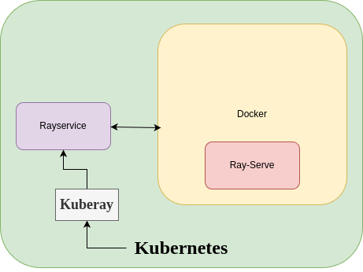

# Ray Serve

## Section I

- Deploy machine learning models as http endpoints
- Scale the deployment using replicas, CPU and GPU resources.
- Combine multiple models with ease

## Section II

- Serve CLI to deploy ray app.

## Section III

- For production, it is typical to use Kuberay's rayservice to run ray serve.
- It handles health checking, status reporting, failure recovery, upgrades.