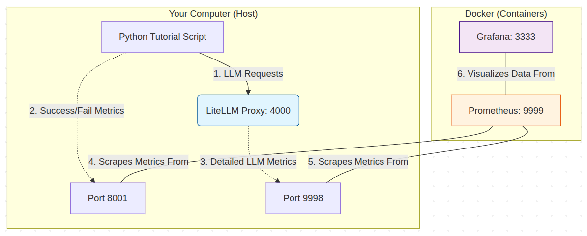

## LLM Routing Techniques with LiteLLM, Prometheus & Grafana

This repository demonstrates advanced LLM routing techniques using [LiteLLM](https://docs.litellm.ai/), integrated with Redis for caching and Prometheus/Grafana for full observability. 

### Features & Routing Techniques

1. **Semantic Routing** - Uses embedding-based similarity matching to route queries based on meaning and intent.
2. **Cost-Aware Routing** - Optimizes the cost-quality tradeoff by dynamically selecting between expensive frontier models and cheaper alternatives.
3. **Intent-Based Routing** - Analyzes query complexity, domain, and structure to select specialized models.
4. **Cascading Routing** - Progressive escalation through model tiers, starting cheap and escalating only when needed (Fallback mechanisms).
5. **Load Balancing** - Distributes requests across providers and API keys for reliability and throughput.
6. **Observability** - Built-in integration with Prometheus & Grafana to monitor latency, cost, success/failure rates, and usage.
7. **Caching** - Redis integration to quickly serve identical queries, reducing latency and cost.

### Supported Models Configured

- **Ollama**: `ollama/llama3.2` (Local inference)
- **Google Gemini**: `gemini/gemini-2.5-flash` (or newer Gemini Flash models, configured in `config.yaml`)

---

### Architecture Overview:

1. The Core Ports (Endpoints)

Port 4000 (LiteLLM Proxy): This is the Input, where our application (like the Python script) send their LLM requests here. It acts as the gateway to Ollama and Gemini.

Port 8001 (Python Script): This is a Metric Source. While the script is running, it starts a tiny server on this port that exposes "Live" statistics about its performance (number of requests, latency, etc.).

2. The Internal Metrics Hub
Port 9998 (LiteLLM Internal Metrics): This is also a Metric Source. When the LiteLLM Proxy (on port 4000) handles a request, it records the data and serves it on port 9998 specifically for Prometheus to read.

3. The Monitoring UI
Port 9999 (Prometheus): This is the Brain and the Dashboard.



The Data Flow:

Requests: The script sends requests to the Proxy on 4000.

Tracking: Both the script (on 8001) and the Proxy (on 9998) keep a count of what happened.

Collection: Every 5 seconds, Prometheus (9999) reaches out to 8001 and 9998 to "scrape" (pull) the latest numbers.

Observation: You open localhost:9999 in your browser to see the raw data, or localhost:3333 (Grafana) to see beautiful charts built using that data.

By splitting them up, we ensured that the completion traffic (4000), the script stats (8001), the proxy stats (9998), and the UI (9999) don't interfere with each other.

---
## Prerequisites

- Python virtual environment (e.g., `deepagent-env`)
- Docker & Docker Compose
- [Ollama](https://ollama.com/) running locally with the `llama3.2` model (`ollama run llama3.2`)
- Google Gemini API Key. Store it in a `.env` file or export it:
  ```bash
  export GEMINI_API_KEY="your-api-key"
  ```

## 🛠️ Installation & Setup

### 1. Install Dependencies
```bash
# In your virtual environment, install the required packages
pip install "pydantic>=2.9" litellm sentence-transformers numpy redis
```
*(Note: Ensure your environment uses Pydantic >= 2.9, as modern router setups and Gemini client SDKs require it).*

### 2. Start Infrastructure (Redis, Prometheus, Grafana)
We use Docker Compose to completely sandbox and spin up the required backing services.

```bash
docker compose up -d
```
- **Redis**: Runs on `localhost:6379` (Used by LiteLLM for caching)
- **Prometheus**: Runs on `localhost:9999` (Scrapes metrics from the LiteLLM proxy)
- **Grafana**: Runs on `localhost:3333` (Visualization UI)

*(Note: The `docker-compose.yaml` is pre-configured with `extra_hosts` to map `host.docker.internal:host-gateway` so Prometheus on Linux can scrape LiteLLM running on your local host).*

### 3. Start LiteLLM Proxy
Run the LiteLLM proxy server using the provided config. 

```bash
# Ensure you run this using the same python environment you installed litellm in
litellm --config config.yaml --port 4000
```
*(Keep this running in a separate terminal tab).*

### 4. Run the Client Script
Execute the tutorial Python script to see the routing techniques natively querying the proxy:

```bash
python lite_llm_routing_techniques_tutorial.py
```

---

## 📊 Analytics & Dashboards (Grafana)

With the LiteLLM Proxy running, you can monitor your routing strategies in real-time.

1. Open **Grafana**: [http://localhost:3333](http://localhost:3333) (Default initial login: `admin` / `admin`)
2. Link the Prometheus Data Source:
    - Go to **Connections -> add new Connection -> Prometheus**.
    - For the **Prometheus server URL**, input: `http://prometheus:9090` (Use this internal Docker hostname, NOT localhost or 9999 because Grafana and Prometheus are on the internal docker network).
    - Save & Test.
3. Import the LiteLLM Dashboard:
    - Go to **Dashboards -> Import**.
    - Enter Dashboard ID **`20542`** and click Load to get the official LiteLLM metrics dashboard template.

---

## Configuration Breakdown
- `config.yaml`: The backbone of the repository. Defines model deployments, router settings, caching configuration (Redis mapping), and registers Prometheus callbacks for logging observability.
- `docker-compose.yaml`: Configures the interconnected containers for Redis (Data), Prometheus (Scraping), and Grafana (Visuals).
- `prometheus.yml`: Custom targets configurations letting Prometheus locate your LiteLLM engine.