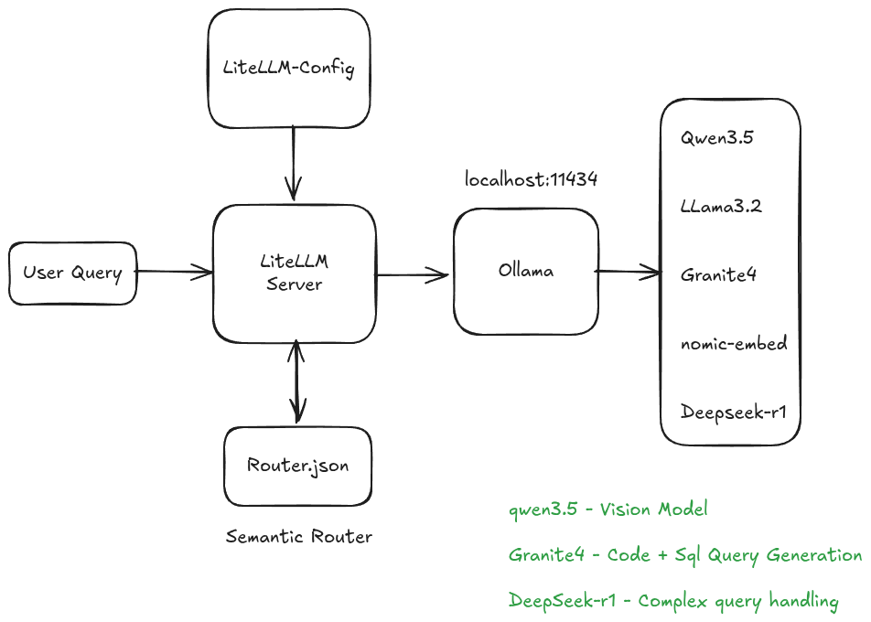

# LiteLLM with Ollama & Semantic Routing

This project demonstrates how to use **LiteLLM** as a proxy server to interact with multiple **Ollama** models through a unified, OpenAI-compatible API. It features **Semantic Routing**, which automatically directs your requests to the most suitable model based on the input's context.

## 🚀 Key Features

-   **Unified API Experience**: Access all your local models through a single endpoint (`/chat/completions`).
-   **Intelligent Semantic Routing**: Automatically routes tasks like Vision analysis or SQL generation to specialized models using `router.json`.
-   **Local-First**: Complete privacy and no API costs by running everything on your own machine via Ollama.

## Flow: LiteLLM + Ollama + Semantic Routing



## 🛠️ Setup & Installation

### 1. Prerequisites

-   **Ollama**: Install from [ollama.com](https://ollama.com).
-   **Python 3.10+**: Recommended for best compatibility.

### 2. Ollama Installation and Download Required Models

Pull the models used in this configuration:

```bash
curl -fsSL https://ollama.com/install.sh | sh
ollama pull qwen3.5:0.8b
ollama pull granite3.1-moe
ollama pull granite4:350m
ollama pull nomic-embed-text
```

### 3. Install Dependencies

```bash
pip install litellm[proxy] requests
```

### 4. Run the LiteLLM Proxy

Launch the proxy server using the provided configuration:

```bash
litellm --config litellm_config.yaml
```
The proxy will start on `http://0.0.0.0:4000`.

## 🧠 Behind the Scenes: Semantic Routing

The semantic router uses an embedding model (`nomic-embed-text`) to compare incoming user prompts against predefined "utterances" in `router.json`.

-   If the prompt is about images/vision, it routes to `image-inputs`.
-   If the prompt is about code/SQL, it routes to `code-snippets-sql`.
-   All other requests fall back to the `general-llm`.

## 💻 Usage Examples

### Basic Chat Completion
Run the following to test a simple request to the default model:
```bash
python llm_requests.py
```

### Vision / Image Analysis
The `request_image.py` script encodes `image.png` and sends it to the proxy. The semantic router detects the vision-related query and routes it to `image-inputs` (e.g., Qwen 3.5).
```bash
python request_image.py
```

### SQL Generation
The semantic router identifies SQL queries and routes them to a specialized model like `granite3.1-moe`.
```bash
python request_sql.py
```


## 📄 License
MIT License
