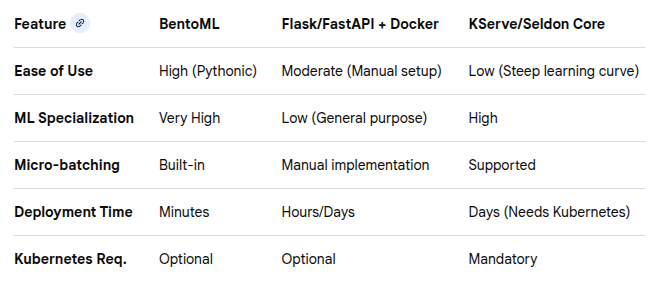

## Getting Started with BentoML

- BentoML >> Flask, FastAPI, or raw Docker: for machine learning model deployment.
- Quick transistion from development to production. 
- It streamlines the entire process—packaging, serving, and deployment—into a unified, high-performance workflow.

In this tutorial, we'll demonstrate how to serve a text summarization model from Hugging Face in BentoML.

- Set up the BentoML environment
- Create a BentoML Service
- Serve the model locally

### Comparison Summary



### Set up the BentoML Environment

```bash
python3 -m venv deepagent-env
source deepagent-env/bin/activate
pip install bentoml torch transformers
```

### For interested readers:

**why BentoML is often chosen:**
1. Superior Model Packaging ("The Bento") 

• Standardized Unit: It packages the model, source code, dependencies, and Docker base images into a single, immutable, versioned bundle called a "Bento". 
• Reproducibility: This ensures the model runs identically in development, staging, and production, eliminating the "it works on my machine" problem. 
• Centralized Model Store: It provides a registry to track and manage multiple versions of models. [1, 3]  

2. High-Performance Serving 

• Adaptive Micro-batching: Unlike FastAPI, which handles requests one-by-one, BentoML can automatically group incoming requests into batches to maximize GPU/CPU utilization, significantly increasing throughput. 
• Asynchronous Processing: Built on ASGI, it handles multiple requests concurrently. 
• Separate Runners: It separates API server processes from model inference processes, preventing heavy computation from stalling the API. [1, 4, 5]  

3. Developer Experience (Dev-to-Prod Speed) 

• Minimalist Code: Developers can turn a trained model into a production-ready API in just a few lines of Python code. 
• No Manual Dockerfiles: BentoML automatically generates Docker images, saving hours of configuration. 
• Built-in API Documentation: It auto-generates a Swagger UI for testing and documentation. [1, 2, 3, 5, 6]  

4. Flexibility and Ecosystem Integration 

• Framework Agnostic: It supports popular frameworks like PyTorch, TensorFlow, Scikit-learn, XGBoost, and Hugging Face Transformers. 
• Multi-Model Serving: It easily handles complex pipelines where multiple models work together (e.g., in RAG applications). 
• Integration:  It works seamlessly with CI/CD tools (GitHub Actions, Jenkins), MLflow, and Kubernetes 
. 

5. Production-Ready Features 

• Scalability: Supports autoscaling (including scale-to-zero) and is highly compatible with Kubernetes, particularly through its companion tool, Yatai. 
• Observability: Includes built-in monitoring, logging, and tracing hooks, crucial for LLM-specific metrics. 
• Cold Start Mitigation: Life-cycle hooks allow for preloading models to reduce latency. [1, 4, 7, 9]  

In short, BentoML is chosen for speed and efficiency, allowing teams to spend more time building models and less time maintaining infrastructure. [1, 13]  

[1] https://www.gocodeo.com/post/how-bentoml-enables-scalable-model-packaging-and-serving
[2] https://medium.com/@nikitaagarwala16/bentoml-helping-deploy-ml-models-in-production-d3a11ea9acb4
[3] https://www.gocodeo.com/post/bentoml-deploying-machine-learning-models-made-simple
[4] https://bentoml.com/blog/introducing-bentoml-10
[5] https://www.bentoml.com/blog/breaking-up-with-flask-amp-fastapi-why-ml-model-serving-requires-a-specialized-framework
[6] https://www.linkedin.com/pulse/bentoml-streamlining-machine-learning-model-umer-haddii-bdltf
[7] https://www.bentoml.com/blog/comparison-between-vertex-ai-and-bentoml
[8] https://bentoml.com/blog/mlops-with-bentoml
[9] https://www.bentoml.com/blog/why-bento-is-built-for-full-scale-ai-production-workloads
[10] https://github.com/bentoml/BentoML
[11] https://pipeline2insights.substack.com/p/introduction-to-data-load-tool-dlt
[12] https://tembo.io/blog/windsurf-vs-cline
[13] https://www.bentoml.com/blog/6-infrastructure-pitfalls-slowing-down-your-ai-progress

