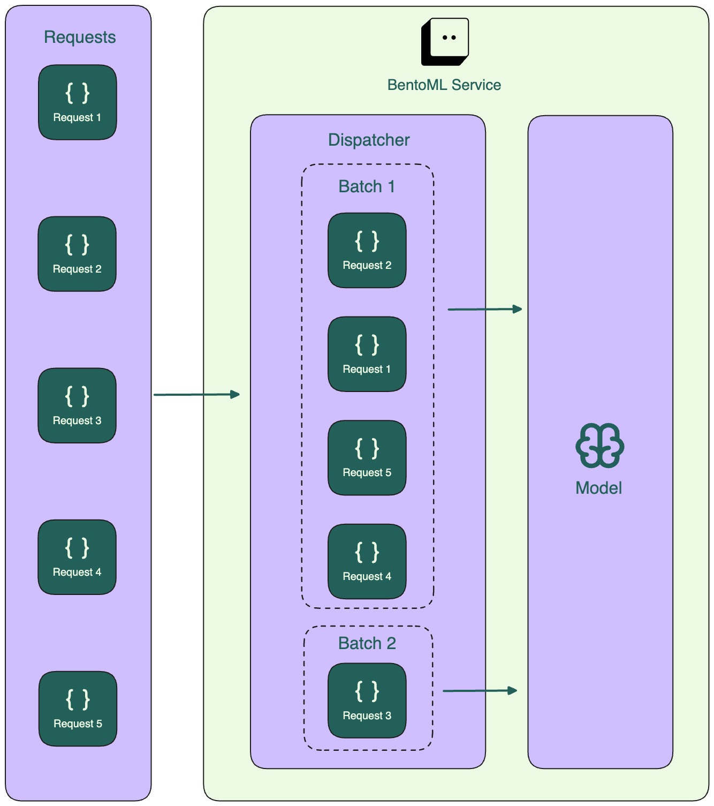
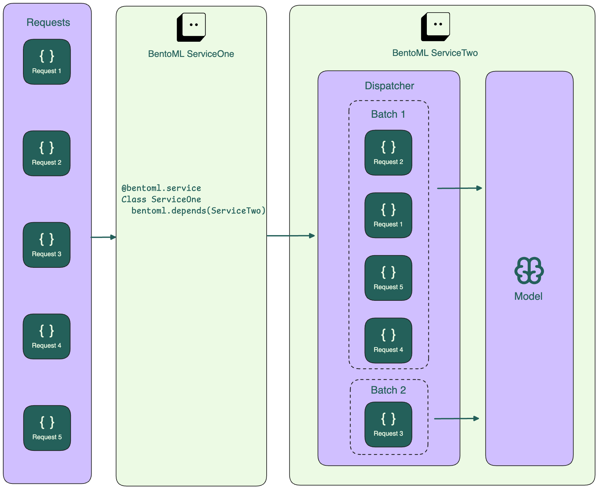
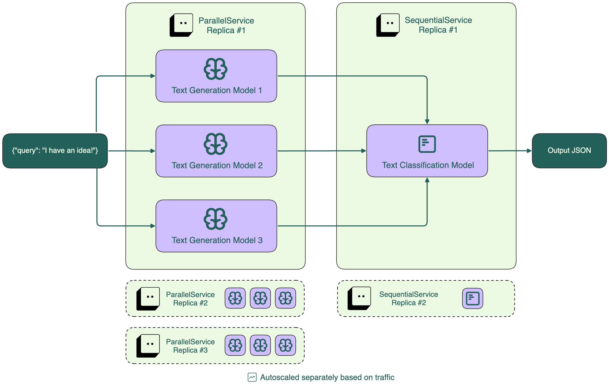

## Getting Started with BentoML

- BentoML >> Flask, FastAPI, or raw Docker: for machine learning model deployment.
- Quick transistion from development to production. 
- It streamlines the entire process—packaging, serving, and deployment—into a unified, high-performance workflow.

In this tutorial, we'll demonstrate how to serve a text summarization model from Hugging Face in BentoML.

- Set up the BentoML environment
- Create a BentoML Service
- Serve the model locally

### Comparison Summary


### Set up the BentoML Environment

```bash
python3 -m venv deepagent-env
source deepagent-env/bin/activate
pip install bentoml torch transformers
```
---------------------------------------------------------------------------------------------------------------------------------------------------------

## Adaptive Batching In BentoML

A major challenge with ML inference is how to utilize the resources effectively especially the GPU. Handling one request at a time results in reduced usage of GPU RAM, also higher latency when multiple requests are sent, and poor throughput. To overcome this, Batching comes into the picture.

Many models achieve higher throughput, better resource utilization, and lower latency when processing requests in batches. 

- BentoML supports **adaptive batching**, a dynamic request dispatching mechanism that intelligently groups multiple requests for more efficient processing.
- It continuously adjusts batch size and window based on real-time traffic patterns. 
- This ensures optimal performance as it provides fast responses during low-traffic periods and maximizes resource utilization under heavy load.

### Terms around Batching

Batching means grouping multiple inputs into a single batch for processing. It includes two main concepts:

**Batch window:** Maximum time a service waits to accumulate requests into a batch before processing.

**Batch size:** Maximum number of requests in a batch.

### Adaptive Batching Architecture

Adaptive Batching is implemented on the server side, and is more efficient during high traffic volume.

BentoML uses dispatcher to oversee the collection of request into a batch untill condition of the batch window or batch size is met, at which point the batch is sent to the model for inference.



For multiple Services, the Service responsible for running model inference (ServiceTwo in the diagram below) collects requests from the intermediary Service (ServiceOne) and forms batches based on optimal latency.



The adaptive batching algorithm continuously learns and adjusts the batching parameters based on recent trends in request patterns and processing time. This means that during high traffic time, batches are likely to be larger and processed more frequently, whereas during quieter periods, BentoML will prioritize reducing latency, even if that means smaller batch sizes.

The order of the requests in a batch is not guaranteed.

### Model Composition In BentoML

BentoML allows you to compose multiple models into a single service. This is useful for complex applications where different models need to work together, such as in Retrieval-Augmented Generation (RAG) systems.

In BentoML, you can create a service that combines multiple models, each with its own runner. This allows you to handle different types of requests and orchestrate the flow of data between models.



BentoML provides Service APIs for creating workflows, where models need to work

- Either in sequence (one after another)
- or in parallel(at the same time).

When to use model composition:
- Processing different types of data (e.g., text and images)
- Improve accuracy by combining predictions from multiple models
- Run different models on specialized hardware (e.g., GPU for one model, CPU for another)
- Orchestrate sequential steps like preprocessing, inference, and postprocessing with specialized models or services

### For interested readers:

**why BentoML is often chosen:**
1. Superior Model Packaging ("The Bento") 

• Standardized Unit: It packages the model, source code, dependencies, and Docker base images into a single, immutable, versioned bundle called a "Bento". 
• Reproducibility: This ensures the model runs identically in development, staging, and production, eliminating the "it works on my machine" problem. 
• Centralized Model Store: It provides a registry to track and manage multiple versions of models. [1, 3]  

2. High-Performance Serving 

• Adaptive Micro-batching: Unlike FastAPI, which handles requests one-by-one, BentoML can automatically group incoming requests into batches to maximize GPU/CPU utilization, significantly increasing throughput. 
• Asynchronous Processing: Built on ASGI, it handles multiple requests concurrently. 
• Separate Runners: It separates API server processes from model inference processes, preventing heavy computation from stalling the API. [1, 4, 5]  

3. Developer Experience (Dev-to-Prod Speed) 

• Minimalist Code: Developers can turn a trained model into a production-ready API in just a few lines of Python code. 
• No Manual Dockerfiles: BentoML automatically generates Docker images, saving hours of configuration. 
• Built-in API Documentation: It auto-generates a Swagger UI for testing and documentation. [1, 2, 3, 5, 6]  

4. Flexibility and Ecosystem Integration 

• Framework Agnostic: It supports popular frameworks like PyTorch, TensorFlow, Scikit-learn, XGBoost, and Hugging Face Transformers. 
• Multi-Model Serving: It easily handles complex pipelines where multiple models work together (e.g., in RAG applications). 
• Integration:  It works seamlessly with CI/CD tools (GitHub Actions, Jenkins), MLflow, and Kubernetes 
. 

5. Production-Ready Features 

• Scalability: Supports autoscaling (including scale-to-zero) and is highly compatible with Kubernetes, particularly through its companion tool, Yatai. 
• Observability: Includes built-in monitoring, logging, and tracing hooks, crucial for LLM-specific metrics. 
• Cold Start Mitigation: Life-cycle hooks allow for preloading models to reduce latency. [1, 4, 7, 9]  

In short, BentoML is chosen for speed and efficiency, allowing teams to spend more time building models and less time maintaining infrastructure. [1, 13]  

[1] https://www.gocodeo.com/post/how-bentoml-enables-scalable-model-packaging-and-serving
[2] https://medium.com/@nikitaagarwala16/bentoml-helping-deploy-ml-models-in-production-d3a11ea9acb4
[3] https://www.gocodeo.com/post/bentoml-deploying-machine-learning-models-made-simple
[4] https://bentoml.com/blog/introducing-bentoml-10
[5] https://www.bentoml.com/blog/breaking-up-with-flask-amp-fastapi-why-ml-model-serving-requires-a-specialized-framework
[6] https://www.linkedin.com/pulse/bentoml-streamlining-machine-learning-model-umer-haddii-bdltf
[7] https://www.bentoml.com/blog/comparison-between-vertex-ai-and-bentoml
[8] https://bentoml.com/blog/mlops-with-bentoml
[9] https://www.bentoml.com/blog/why-bento-is-built-for-full-scale-ai-production-workloads
[10] https://github.com/bentoml/BentoML
[11] https://pipeline2insights.substack.com/p/introduction-to-data-load-tool-dlt
[12] https://tembo.io/blog/windsurf-vs-cline
[13] https://www.bentoml.com/blog/6-infrastructure-pitfalls-slowing-down-your-ai-progress

