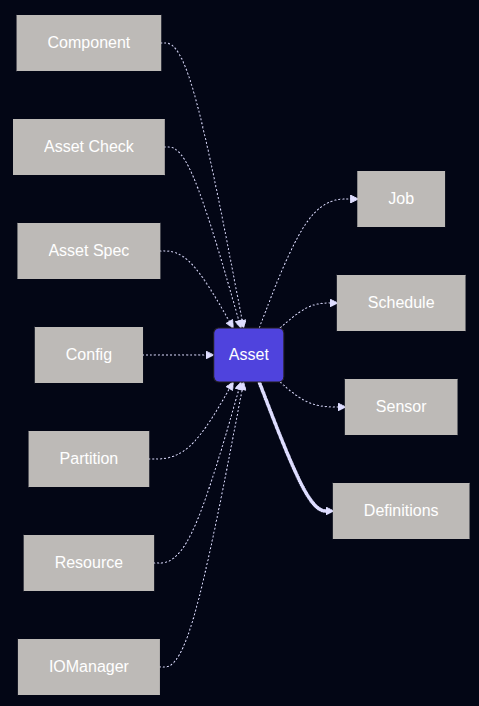

## Getting Started With Dagster

**Dagster is a data orchestrator built for data engineers, with integrated lineage, observability, a declarative programming model, and best-in-class testability.**

**Installation**

```
curl -LsSf https://astral.sh/uv/install.sh | sh
curl -LsSf https://dg.dagster.io/create-dagster/install.sh | sh
create-dagster project my-dagster-project # this create virtual env and install all the dependency packages
source my-dagster-project/.venv/bin/activate
cd my-dagster-project
dg --version # to verify dagster
```

An asset represents a logical unit of data such as a table, dataset, or machine learning model. Assets can have dependencies on other assets, forming the data lineage for your pipelines. As the core abstraction in Dagster, assets can interact with many other Dagster entities to facilitate certain tasks. When you define an asset, either with the @dg.asset decorator or via a component, the definition is automatically added to a top-level Definitions object. 



## ETL Pipeline With Dagster

Above we created the virtual environment, next we switch to the environment and spin-up Dagster webserver at `localhost:3000` using `dg dev`

```
dg dev
```

**First step of ETL - Extract Data**

In the first step in our pipeline, we will use software-defined assets to load files into DuckDB, an analytical database. This data will serve as the foundation for the rest of the ETL tutorial.

```
dg scaffold --help
```

**Creating an asset**

```
dg scaffold defs dagster.asset assets.py
```

It creates an assets.py that will contain our asset code to the my_dagster_project module. Using dg to create the file ensures that the file is in a location where it can be automatically discovered by Dagster:

```
src
└── my_dagster_project
    └── defs
        └── assets.py
```

**Write DuckDB helper functions**

Installing in Dagster Environment

```
uv add duckdb
```

### DuckDB Function to execute query

duckdb is used for communicating with duckdb database running locally. We define multiple \
assets using the same duckdb database. With below function, we ensure that each asset \
can acquire a lock on the DuckDB database file when writing data:

```python
# src/my_dagster_project/defs/assets.py
import duckdb
import filelock


def serialize_duckdb_query(duckdb_path: str, sql: str):
    """Execute SQL statement with file lock to guarantee cross-process concurrency."""
    lock_path = f"{duckdb_path}.lock"
    with filelock.FileLock(lock_path):
        conn = duckdb.connect(duckdb_path)
        try:
            return conn.execute(sql)
        finally:
            conn.close()

```

The function ensures that the query holds a lock on the file throughout its execution.

**Ingest data into DuckDB**

We load three files as three tables into duckdb. 

https://raw.githubusercontent.com/dbt-labs/jaffle-shop-classic/refs/heads/main/seeds/raw_payments.csv \
https://raw.githubusercontent.com/dbt-labs/jaffle-shop-classic/refs/heads/main/seeds/raw_orders.csv \
https://raw.githubusercontent.com/dbt-labs/jaffle-shop-classic/refs/heads/main/seeds/raw_customers.csv

```python
def import_url_to_duckdb(url: str, duckdb_path: str, table_name: str):
    create_query = f"""
        create or replace table {table_name} as (
            select * from read_csv_auto('{url}')
        )
    """

    serialize_duckdb_query(duckdb_path, create_query)

```

This function will take in the URL for one of our files and a table name, and load the data into DuckDB using DuckDB CSV import functionality. Then using the serialize_duckdb_query function we just defined, it will execute the query while ensuring a proper lock on the DuckDB database. Each table is an asset.

### Defining Assets

**Creating Asset as Table In DuckDB**

```python
import dagster as dg


@dg.asset(kinds={"duckdb"}, key=["target", "main", "raw_customers"])
def raw_customers() -> None:
    import_url_to_duckdb(
        url="https://raw.githubusercontent.com/dbt-labs/jaffle-shop-classic/refs/heads/main/seeds/raw_customers.csv",
        duckdb_path="/tmp/jaffle_platform.duckdb",
        table_name="jaffle_platform.main.raw_customers",
    )


@dg.asset(kinds={"duckdb"}, key=["target", "main", "raw_orders"])
def raw_orders() -> None:
    import_url_to_duckdb(
        url="https://raw.githubusercontent.com/dbt-labs/jaffle-shop-classic/refs/heads/main/seeds/raw_orders.csv",
        duckdb_path="/tmp/jaffle_platform.duckdb",
        table_name="jaffle_platform.main.raw_orders",
    )


@dg.asset(kinds={"duckdb"}, key=["target", "main", "raw_payments"])
def raw_payments() -> None:
    import_url_to_duckdb(
        url="https://raw.githubusercontent.com/dbt-labs/jaffle-shop-classic/refs/heads/main/seeds/raw_payments.csv",
        duckdb_path="/tmp/jaffle_platform.duckdb",
        table_name="jaffle_platform.main.raw_payments",
    )
```

In Dagster, an asset is defined by the @dg.asset. Any function with that decorator will be treated as part of the Dagster asset graph. Within that decorator, we can define some optional characteristics of the asset itself:

The kinds argument adds metadata about the tools and technologies used by the asset.
The key argument defines the key path of the asset. Without setting the key argument, the asset key will be the function name. Here we will explicitly set a key for our assets to work with our dbt project in the next step.

### Dagster Definitions

In Dagster, all the objects we define (such as assets) need to be associated with a top-level Definitions object in order to be deployed. When we first created our project with uvx create project, a definitions.py file was created as well:

```python
from pathlib import Path

from dagster import definitions, load_from_defs_folder


@definitions
def defs():
    return load_from_defs_folder(project_root=Path(__file__).parent.parent.parent)
```

This Definitions object loads the etl_tutorial module and automatically discovers all the assets and other Dagster objects we define. There is no need to explicitly include any references to assets as they are created. However, it is a good practice to check that the Definitions object can be loaded without error as we add Dagster objects.

We can use dg to ensure that everything we define in our module is loading correctly and that our project is deployable. Here we can use the dg check defs command:

```
dg check defs
```

### Materialize the assets

Now that our assets are configured and we have verified that the top-level Definitions object is valid, we can view the asset catalog within the Dagster UI. Navigate back to http://127.0.0.1:3000 (or restart dg dev if you have closed it) and reload the definitions:

- Go to Assets in UI
- Select all the assets and click Materialize Selected.
- Go to Runs to view the logs and status.

--- Data Ingestion Is Done ---

## Data Transformation

Data Modeling with dbt.

Download a dbt model to work with data extracted from previous step.

```
git clone --depth=1 https://github.com/dagster-io/jaffle-platform.git transform && rm -rf transform/.git
```

To work dagster with dbt and duckdb, we install two packages

```
uv add dagster-dbt dbt-duckdb
```

**Turn the dbt project into asset**

Previously, we used `@dg.asset` manually on functions to create asset. For dbt project, we'll use \
component, a predefined ways to interact with common integrations or patterns. In this case, we \
will use the dbt component to quickly turn our dbt project into assets.

```
dg scaffold defs dagster_dbt.DbtProjectComponent transform --project-path transform/jdbt
```

It creates a defs.yaml, unlike assets file which was in Python. To check that Dagster can load the \
dbt component definition correctly in the top-level Definitions object, run dg check again:

```
dg check defs
```

The component is correctly configured for our dbt project, but we need to make one addition to the YAML file:

```
type: dagster_dbt.DbtProjectComponent

attributes:
  project: '{{ project_root }}/transform/jdbt'
  translation:
    key: "target/main/{{ node.name }}"
```

Adding in the translation attribute aligns the keys of our dbt models with the assets we defined previously. Associating them together ensures the proper lineage across our assets.

### Materialize the assets

Now that our assets are configured and we have verified that the top-level Definitions object is valid, \
we can view the asset catalog within the Dagster UI. Navigate back to http://127.0.0.1:3000 (or restart \
dg dev if you have closed it) and reload the definitions:

- Go to Assets in UI (Restart dagster if required.)
- Select all the assets and click Materialize Selected.
- Go to Runs to view the logs and status.

## Add DuckDB Resource

To more efficiently manage our database connections.

Currently, each asset handles its own connection separately. In this step, we'll add \
one more dagster object to manage Duckdb connections. Adding a resource will allow us \
to centralize our connection to DuckDB in a single object that can be shared across all our Dagster objects.

**Define DuckDB Resource**

```
uv add dagster-duckdb pandas
```

Next, we need to scaffold our resources file with dg:

```
dg scaffold defs dagster.resources resources.py
```

It creates resources.py in defs folder. Within this file, we will define our DuckDBResource \
resource from the dagster-duckdb library. This consolidates the database connection in one \
place. Next, we will define a resources function with the @dg.Definitions. This function will \
map all of our resources to specific keys throughout our Dagster project:

```python
from dagster_duckdb import DuckDBResource

import dagster as dg

database_resource = DuckDBResource(database="/tmp/jaffle_platform.duckdb")


@dg.definitions
def resources():
    return dg.Definitions(
        resources={
            "duckdb": database_resource,
        }
    )
```

Here we are setting the key duckdb to the DuckDBResource we just defined. Now any Dagster \
object that uses that resource key will use the underlying resource set for our DuckDB database.

