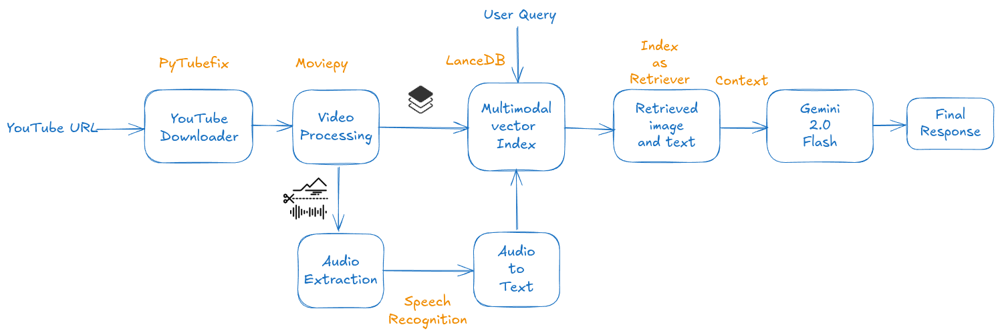

## MultiModal RAG for Advanced Video Processing with LlamaIndex & LanceDB

In this video, we leverage the LlamaIndex Python API for using the advanced capabilities of Gemini’s 2.0 Flash, combined with the efficient data management by LanceDB across all data formats, to process videos.

### RAG Architecture

The architecture typically involves a dense vector search engine for retrieval and a transformer model for generation. The process:

- Performs a semantic search to fetch relevant documents.
- Processes these documents with the query to create a comprehensive context.
- The generative model then crafts a detailed response based on this enriched context.

### Extending to Multimodality

Multimodal RAG integrates various data types (text, images, audio, video) in both retrieval and generation phases, enabling richer information sourcing. For example, responding to queries about “climate change impacts on polar bears” might involve retrieving scientific texts, images, and videos to produce an enriched, multi-format response.

**Solution Section**

- Video Downloading
- Video Processing
- Building the Multi-Modal Index and Vector Store
- Retrieving Relevant Images and Context
- Reasoning and Response Generation